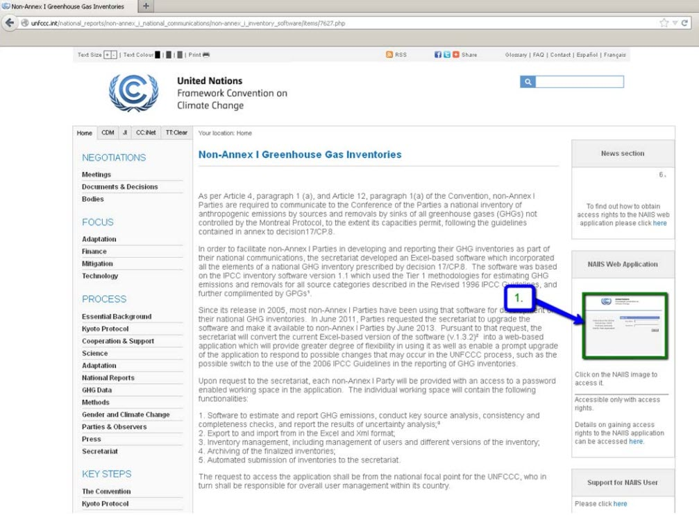
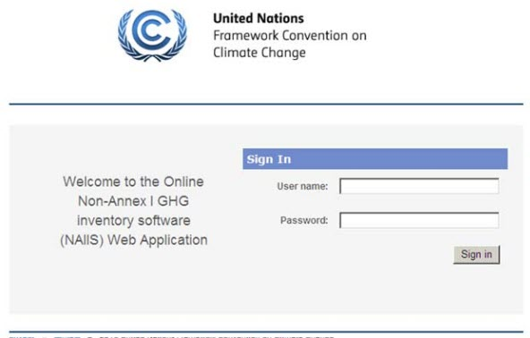
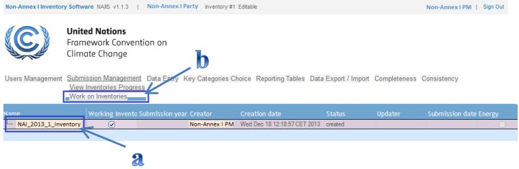
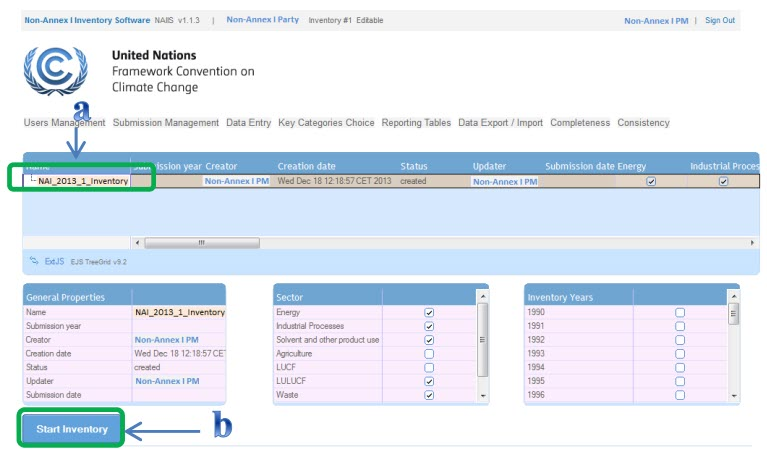
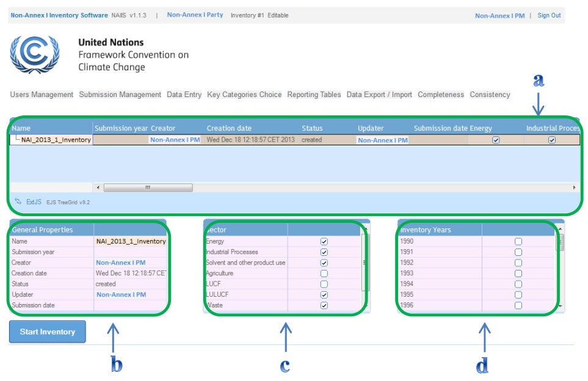
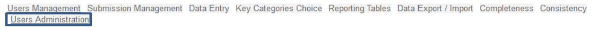
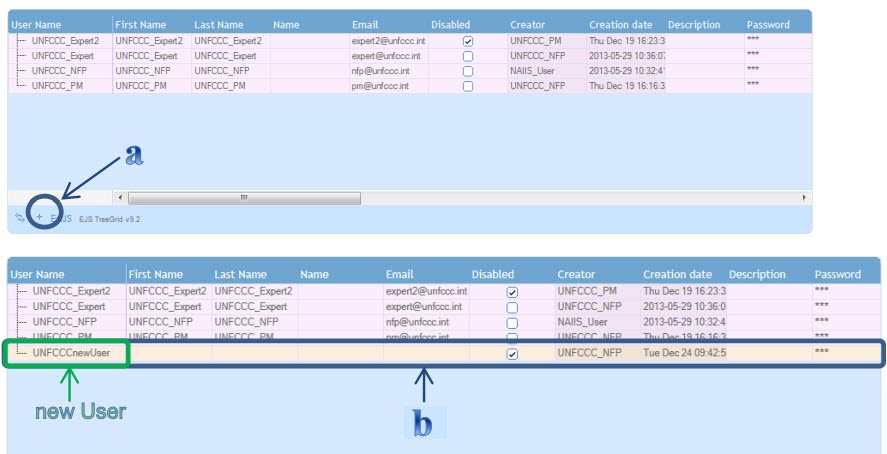
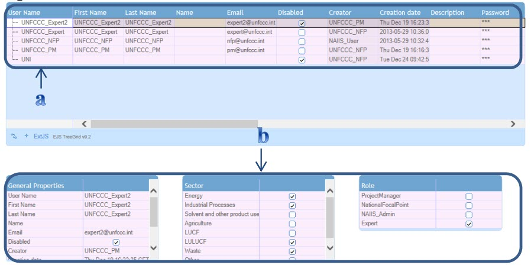

## How to access the NAIIS application
To open and log in the NAIIS application, follow the steps below:
1. Open any internet browser (i.e. Internet Explorer, Firefox, etc.).
2. Type in http://unfccc.int/7627 on the browser’s address bar. 
3. Press **Enter key**. The non-Annex I Greenhouse Gas Inventories web page appears.
4. Select NAIIS Web Application image on the right hand side of the screen (figure 1, pointer 1). The log-in page displays (figure 2). 
5. Enter the username and password and then select **Sign in**. 

_Figure 1_

_Figure 2_

## How to start a GHG inventory	
To start a GHG inventory, follow the steps below:
1. Log in as PM.
2. Hover **Submission Management** and then select **View Inventories Progress**.
3. Select the appropriate GHG Inventory in Status "created" (figure 3a).
4. Hover **Submission Management** and then select **Work on Inventories** (figure 3b). 

_Figure 3_

5. Select the appropriate Inventory with left click (figure 4a).
6. Select **Start Inventory** (figure 4b). The status of the selected Inventory changes to "started".  

_Figure 4_

## How to add a new GHG inventory year (only NFP and PM’s)

1. Log in as NFP or PM.
2. Hover **Submission Management** and then select **Work on Inventories**. The initial screen displays. It includes the following boxes: 
   * Existing Inventory (with all options) (pointer a).
   * General properties – include the name, submission year, creator, creation date, status, updater and submission date (pointer b).
   * Sectors (pointer c).
   * Inventory years (pointer d).

_Figure 5_

## How to add user
**_Note_**: This function is ONLY available for NFP’s and PM’s!

To add user, follow the steps below:
1. Log in as NFP or PM.
2. Hover **Users Management** and then select **Users Administration** (figure 6). The Users Administration screen opens.

_Figure 6_

3. Select **"+"**. A new line for adding new user appeas in the table.
4. Double click the respective cell and then enter a new user name.

**_Note:_** The user's name must be unique and contain at least 3 characters.

5. Press the enter key. New user name is saved in the respective table of the NAIIS database.

-------------------------------------------------------------------------------------
**_Note:_** The ssytem generates new user name(s) as default [Non-Annex I Party name] + “newUser” (e.g. UgandanewUser, PhilippinesnewUser, ArgentinanewUser).

-------------------------------------------------------------------------------------

_Figure 7_

## View user
This function enables NFP and PM to view all users of their country.
To view user, follow the steps below:
1. Log in as NFP or PM.
2. Hover **Users Management** and then select **Users Administration**. The Users Administration screen opens. 
3. Select the respective row. All information of the selected user displays on the General Properties, Sector and Role boxes.

_Figure 8_

## Add new nodes
New nodes, for example, can be added to the navigation tree in order to add either a category, a fluorinated gas (Fgas), a fuel, a livestock type, or a subdivision in the LULUCF sector.

User-defined items can be added for:
   * Categories indicated as "Other (please specify)"
   * LULUCF subdivision
   * User-defined fuels

To add a new child node (both for a pre-defined or a user-defined item), follow the steps below:
1. Right click the parent node.
2. Select **Add new child node**. 

**_Note:_** The parent nodes, where a child node can be added, are highlighted in orange.

## Delete nodes – user defined nodes

**_Note:_** Only user-added nodes can be deleted. 

To delete a node, follow the steps below:
1. Right click the node.
2. Select **Delete child node**.

**_Warning:_** 

When deleting user-defined nodes, delete each child node first. Then, delete the parent node that was added. If a user deletes the parent node before the child nodes, an error message is shown. The nodes will then disappear from the tree. But the nodes are not removed from the database. So the user must click **Reload grid** icon at the bottom of the navigation tree.

After doing so, the child nodes will reappear on the tree. Any data in the grid for the user-added nodes is also deleted from the database when the nodes are removed.

## Delete subnodes
To delete subnodes, follow the steps below:
1. Double click the specific subnode or line. A pop-up window warning message opens.
2. Select **Ok** to delete the sub node.
OR
Select **Cancel** not to delete it.

## Excel export – data entry
To open  the navigation tree, follow the steps below:
1. Select **Data Export / Import**. The navigation tree appears on the left-hand side.

There are three options available to export files:
1. **Export selected single grid**. It allows to export only the data of current selected grid.
2. **Export selected sector / subsector**. It allows to expoprt all data of the current selected grid and the sub sectors.
3. **Export all data entry grids**/ It allows to export all data entry grids.

Once clicked one of the Sector’s or sub sectors’ on the left-hand side navigation tree, three Export buttons will appear on the middle of the screen.
Select one of the **Export** buttons. The system will then generate an excel export file.

--------------------------------------------------------------------------------------
**_Note_**
To see the the file that has been exported, go to **My Data Export** section. 

Select fileLink **File** to open or save the file.

--------------------------------------------------------------------------------------

## Excel/XML data import
The data import tab allows the user to import data into the system with the use of an XML or Excel file.

To import data, follow the steps below:
1. Select **Browse…** (or **Choose file** for Chrome users).
2. Chooe the file to be imported.
3. Select **Submit**. A message displays to confirm successful completion of import. 

**_Warning!_** If the type of the file selected for import is incorrect, an error message displays (only *.xml and *.xlsx files are allowed).

Select **Submit Query** to start the data import process.
Select **My Data Import** to open a list of imported data. You can find it on the left-hand side navigation tree.
Select **My Data import** to see the status of the import process.
Select **File** (column **FileLink**) to open or save the file imported.

**Resource**

The part of the text is taken from [NAIIS Web Application, user manual]("https://unfccc.int/files/national_reports/non-annex_i_national_communications/non-annex_i_inventory_software/application/pdf/naiis-user-manual.pdf)